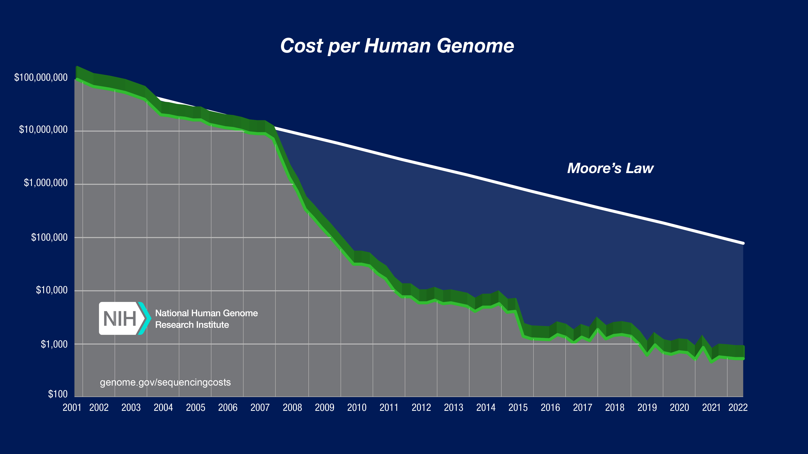
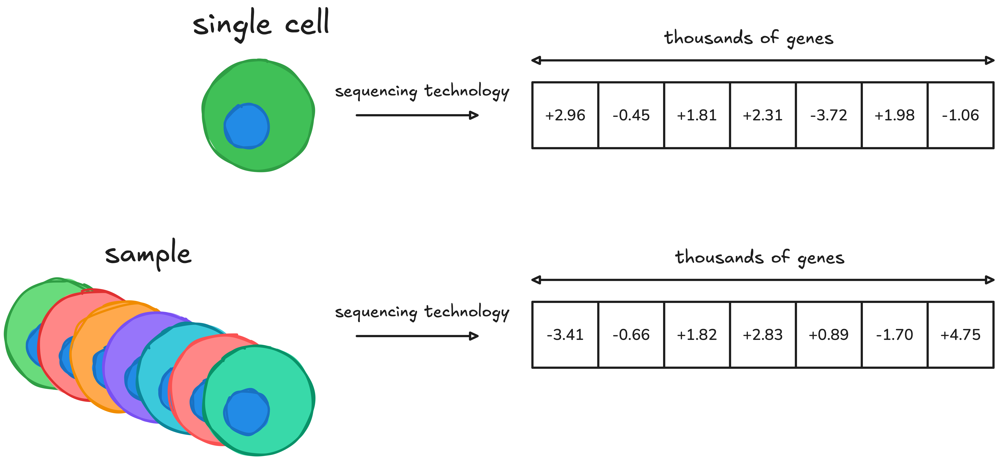
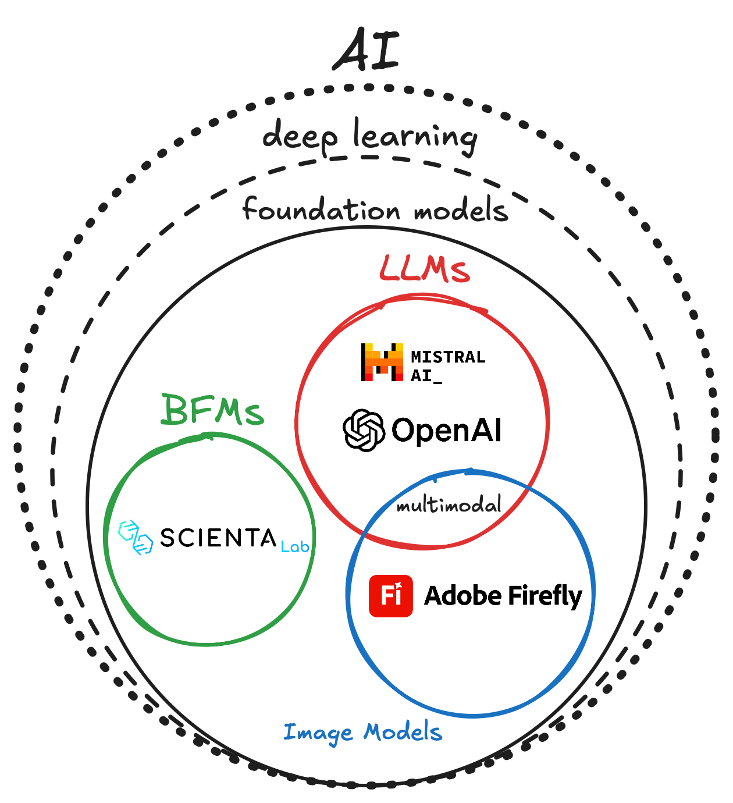
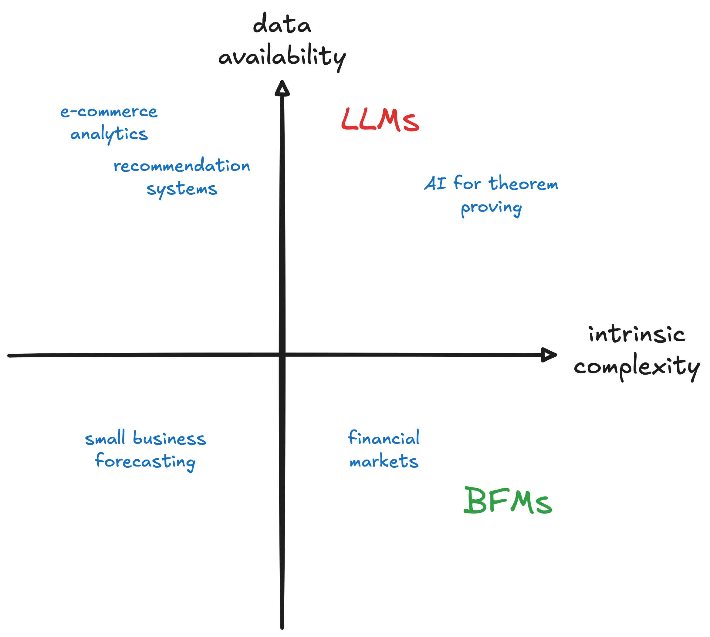
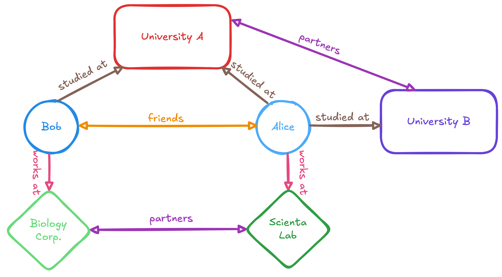
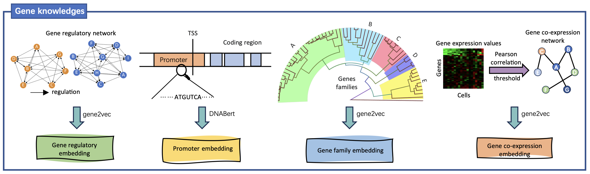
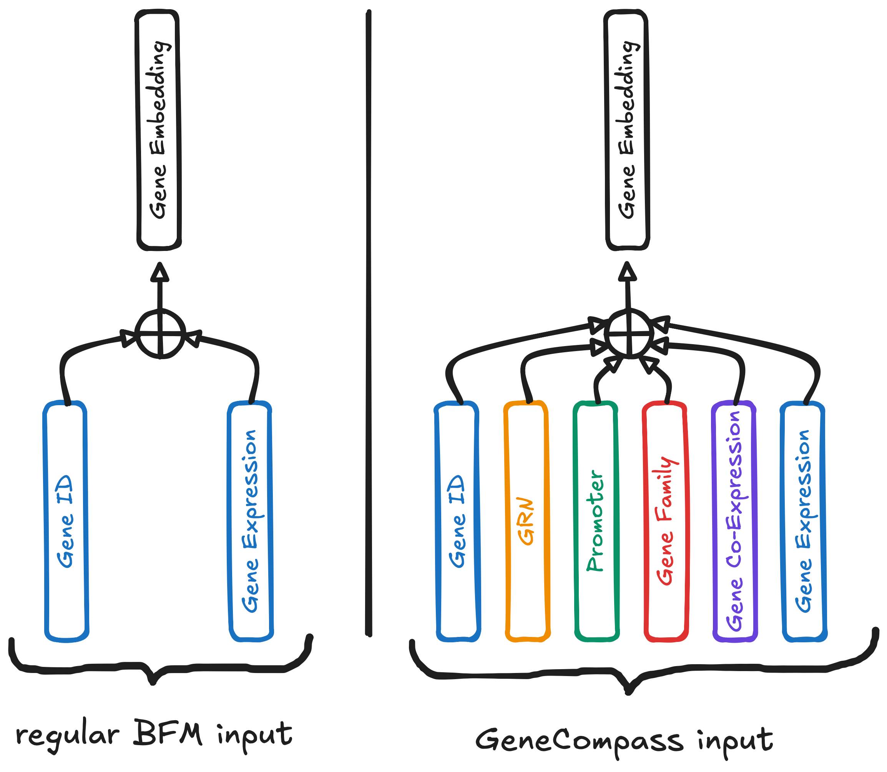
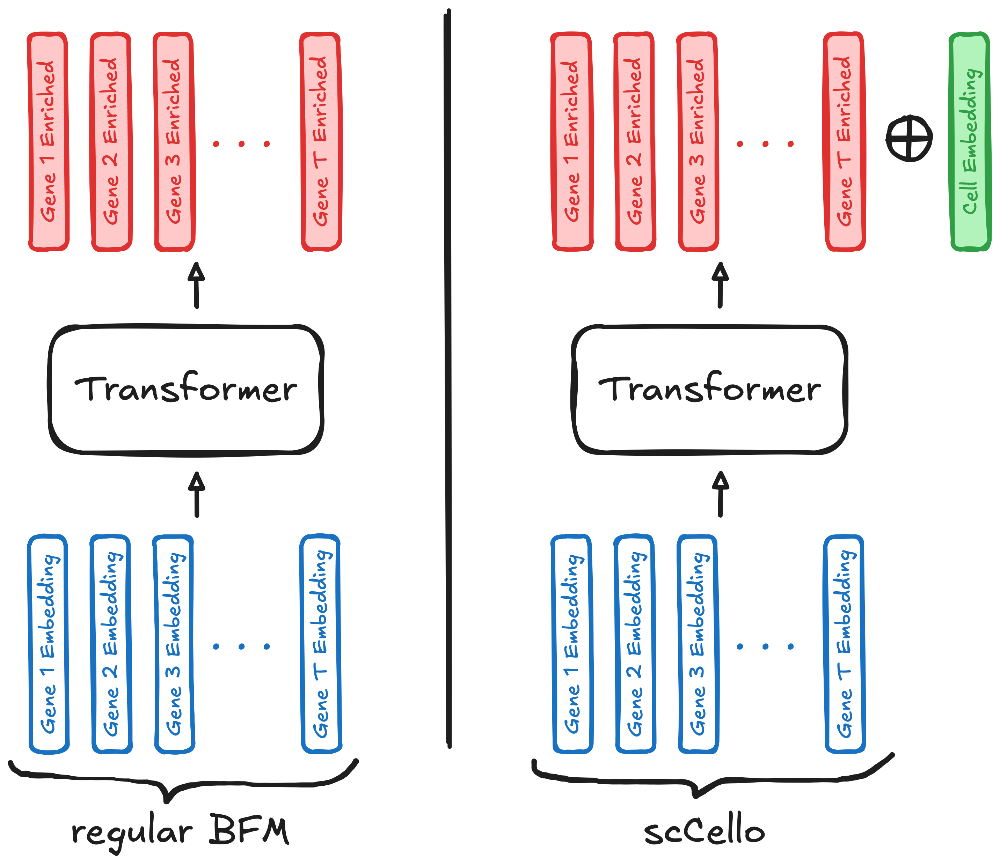
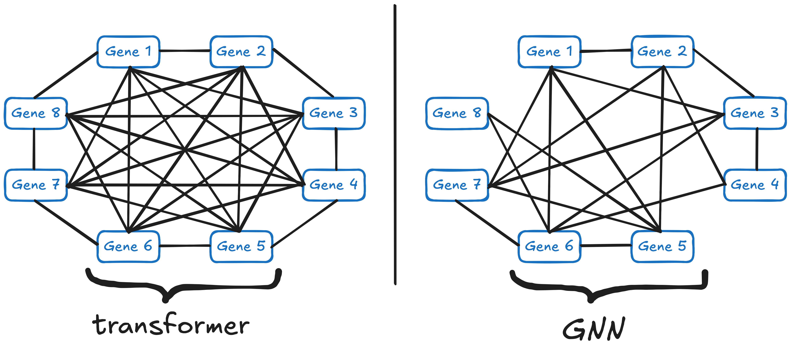

    

        
    

    Biological Foundation Models (BFMs) and Large Language Models (LLMs) are two very different types of foundation models.

NB: I wrote this post as part of my internship at [Scienta Lab](https://www.scientalab.com/), where I worked on integrating knowledge graphs in biological foundation models (BFMs). The goal of this work was to enhance BFMs with highly-curated data, possibly spanning additional modalities.

# Knowledge Graph Integration for Biological Foundation Models

*At Scienta Lab, we are building biological foundation models (BFMs) for immunology and inflammation. We believe that AI can help us accelerate the development of innovative drugs for immune-mediated diseases from the vast amounts of multimodal data accumulated over decades of research. Once trained, our BFMs can be used on a variety of downstream tasks, including prediction of drug candidate efficacy, patient stratification, and biomarker identification.*

*In this blog post, we will present several approaches that integrate knowledge graphs (KGs) to BFMs. The goal of KG integration is to enhance the model with highly-curated data, possibly spanning additional modalities.*

## Table of Contents
- [I. Introduction](#i-introduction)
   - [A. Biological Foundation Models](#a-biological-foundation-models)
   - [B. BFMs vs LLMs](#b-bfms-vs-llms)
   - [C. How Knowledge Graphs Can Help](#c-how-knowledge-graphs-can-help)
- [II. Interesting Approaches](#ii-interesting-approaches)
   - [A. Injecting extra modalities: GeneCompass](#a-injecting-extra-modalities-genecompass)
   - [B. Enforcing cell representation: scCello](#b-enforcing-cell-representation-sccello)
   - [C. Selecting gene-gene interactions: GEARS](#c-selecting-gene-gene-interactions-gears)
   - [D. Appending special tokens: scPRINT](#d-appending-special-tokens-scprint)
- [III. Conclusion](#iii-conclusion)
- [References](#references)

# I. Introduction

## A. Biological Foundation Models

Let’s first define a few terms.

> Foundation models are deep learning models trained on vast datasets so that they can be applied across a wide range of use cases.
> 

A lot of the AI hype today revolves around foundation models for *natural language processing* (NLP), which are often called Large Language Models (LLMs). These are models that people can directly interact with through text messaging, like OpenAI’s ChatGPT or Mistral’s Le Chat. 

While the success of LLMs is undeniable, their area of expertise is not unbounded. For instance, LLMs have no idea how to deal with genetic data simply because they aren’t trained on this data modality.

> Data modality is a fancy term to refer to the “type” of data we are dealing with. The most common modalities in AI are textual and visual data, but there are many more like audio, time series, graph and genomic data.
> 

Emboldened by the prowesses of foundation models in NLP, companies are now racing to adapt these models to other modalities. Biology in particular has been garnering a lot of attention as genomic data keeps getting cheaper thanks to continued advances in gene sequencing technologies, as shown on Figure 1.

*Figure 1: Gene sequencing costs have been decreasing at an exponential rate over the past two decades.*

> Biological foundation models (BFMs) are foundation models trained on one or several biological modalities. Unlike LLMs, these models aren’t primarily designed to work with human language. Instead, their goal is to capture the complex relationships hidden in the large amounts of biological data they were trained on. Just like LLMs can be thought of as super-humans who have read all the books on Earth, BFMs are envisioned to become super-humans who have crunched the biological data of millions of humans (and potentially other organisms), thus uncovering the complex laws of biology.
> 

BFMs are relatively new and exist in all forms and shapes today. In particular, they can differ through the type of modality they tackle.

**In this blog post, we will focus on BFMs for RNA-seq data**.

> “RNA-seq is a technique that uses next-generation sequencing to reveal the presence and quantity of RNA molecules in a biological sample, providing a snapshot of gene expression in the sample, also known as transcriptome.” (cf. [Wikipedia](https://en.wikipedia.org/wiki/RNA-Seq))
> 

Technically, there are two types of RNA-seq data modalities: single-cell and bulk. We will focus on single-cell in this blog post.

> Single-cell RNA-seq provides the expression profiles of individual cells, whereas bulk RNA-seq measures gene expression at the sample level, i.e. across a population of cells.
> 

*Figure 2: RNA-seq technology in a nutshell. Top is single-cell RNA-seq, and bottom is bulk RNA-seq. Note that when we have multiple cells or multiple samples, the vectors on the right are stacked vertically and we obtain a matrix.*

In a nutshell, single-cell RNA-seq data tells us which genes are activated in a given cell, making it a rich description of the state of the cell. However, as we will see in the next paragraph, RNA-seq comes with its own set of challenges.

*Figure 3: Biological Foundation Models (BFMs) and Large Language Models (LLMs) are two different types of foundation models.*

At first sight, it may seem that BFMs are just re-branded LLMs. But there are deep reasons why building BFMs isn’t as straightforward as building LLMs. Let’s dive in!

## B. BFMs vs LLMs

There are two major differences between BFMs and LLMs: intrinsic complexity and data availability.

### Intrinsic complexity

Simply put, a LLM’s goal is to build a *good world representation*. Just like a person who gradually understands the world through sheer experience, a LLM accumulates human knowledge as it is trained on more and more text data.

In a similar fashion, the objective of a BFM is to develop *rich biological representations*, ideally across all modalities. A similar metaphor applies here: just like a biology researcher must spend years, even decades, studying the field to build a valid mental model, a BFM must process vast amounts of data to form a robust internal representation of the complex processes underlying life.

Thus, LLMs and BFMs are both trained to create *meaningul data representations* of their respective domains. The catch is that **the complexities of biology and human knowledge are fundamentally different!** This is clear if we think in terms of *time-scale* and *organization* (or entropy):

> Time-scale: If we define the beginning of “human knowledge” as the invention of writing, then we have been producing knowledge for about 5,000 years. This sounds like a lot until you remember that life on Earth began about 4 billion years ago with the apparition of single-cell organisms.
> 

> Organization: Life on Earth evolved according to a single law: survival of the fittest. As such, evolution is a random and oftentimes messy process, whereas human innovation is a lot more rigorous and stable.
> 

*Takeaway: There are good reasons to believe that the complexity of biology is vastly different from that of human knowledge. Thus, BFMs cannot simply emulate the success of LLMs using a 1:1 approach.*

### **Data availability**

The three key ingredients to build AI systems are:

1. theory (algorithms & models)
2. data
3. compute

While AI progress has been enabled by parallel advances in these three domains, oftentimes a single one will be the bottleneck in a given AI use case.

**For biology, data is by far the limiting factor**. You might answer that LLMs also crave more data, but there are key differences between text data and biological data: volume, quality, and information content. Here I will illustrate those differences on RNA-seq data, though the comparison applies to other biology modalities.

1. **Volume**. Volume is the most obvious difference between text and RNA-seq data. As you probably know, LLMs are trained on huge corpora curated from online content, today’s frontier models are trained on ~10T tokens. In contrast, the largest open RNA-seq datasets contain at most ~50M cells, representing about ~50k independent samples. Since there are about ~2k genes of interest, each represented by a token, this leaves us with 50M × 2k ~ 100B correlated tokens, or 50k × 2k ~ 100M independent tokens. That’s 100 to 100,000 times less data to begin with!

2. **Quality**. The second issue is that text data and RNA-seq data are two widely different creatures. Text is well-behaved: you can read it and understand it, you can easily manipulate it, and it is unambiguous. RNA-seq data is a whole other story: it’s very difficult to grasp (try making sense of a 2000-dimensional vector), there is no agreed-upon way to work with it, and it depends on the lab protocols and sequencing machines used to obtain it, leading to ”batch effects”! What’s more, because biology is very redundant (due the random nature of evolution and the need for robustness in organisms), the amount of raw information contained in RNA-seq is much less than it seems, so we have even less data in practice!

3. **Information Content**. This one is a bit trickier but just as important. Consider the sentence: “The duck is green.” Notice that this text sample contains all the information we could ask for. There is no uncertainty. Now consider a sick patient from whom we collected some cells to run an analysis of their RNA-seq data. Let’s say we end up with a nice 2000-dimensional vector. Would you say that this vector contains all the information needed to understand the patient’s condition? Probably not. And this is the big difference with text: while text is *all the information*, RNA-seq (and any biological modality) is *just a part of the story*. The following metaphor sums it up nicely:
    > Trying to find insights from a single biological data modality is like trying to understand a movie from the sound only: you’re in a for a hard time.
    >

*Takeaway: Text data is ubiquitous, high-quality, and self-contained. Biological data is scarce, low-quality, and just part of the picture.*

*Figure 4: BFMs and LLMs plotted on the intrinsic complexity - data availability plane, alongside other AI use cases.*

## C. How Knowledge Graphs Can Help

The previous paragraph should have convinced you that **data** (not compute, not theory) is the crucial bottleneck when building BFMs.

> The good news is: working with poor data is nothing new in the field of AI, and many methods have been developed over decades of research to tackle this issue.

For the sake of brevity, I’ll list the relevant existing approaches to mitigate this lack of data and which category they fall in.

| **Approach** | Category |
| --- | --- |
| 1. Finding more data | extensive |
| 2. Doing data augmentation | extensive-ish |
| 3. Using inductive biases | intensive |
| 4. Reducing model complexity | intensive |
| **5. Leveraging domain knowledge** | extensive |

As you can see, there’s quite a few ways to tackle lack of data. We can classify them in two broad categories: *intensive* and *extensive*. Intensive methods do not add external information, their goal is to help the model learn more efficiently. On the contrary, extensive methods work by giving more information to the model. Here’s a metaphor to clarify things

> Imagine you are a student trying to get better at math. You could work on methodology to be more efficient on your tests: this would be an intensive effort. But you can also buy a bunch of math textbooks and study them religiously: this would be an extensive approach.
> 

The catch is: intensive approaches will only get you so far. If we go back to the math analogy: even the most elaborate methodology won’t save you on test day if you don’t know the mathematical concepts you need to manipulate!

In the case of BFMs, we’ve seen that data is key. So we need to focus on external methods to build better models. But acquiring biological data is a notoriously lengthy, costly, and uncertain process, for both legal and practical reasons. Could we look for data elsewhere?

**This is where biological knowledge graphs (KGs) come into play!**

If you aren’t familiar with KGs, you can think of them as a networks with several types of nodes and various possible relationships between them. Below is a minimal KG to give you an idea.

*Figure 5: A minimal knowledge graph (KG). Note the different node types (Person, Company, University) and the various kinds of relationships between them.*

Biology KGs are no different from the minimal example above, except that they are *much* larger. For instance, the *Bio2RDF* KG encompasses many biological entities (genes, proteins, diseases, drugs, etc.) and the interactions between them (gene→protein, gene→disease, drug→target, etc.) It boasts over 11 billion triplets (i.e. interactions of the form `node_1->interaction->node_2`), obtained by integrating over 30 biomedical datasets.

There’s a lot more to say about KGs but this goal of this blog post is about *how* to integrate them in BFMs. Indeed, the main challenge with KGs is that they are highly heterogeneous. That is, there’s several types of nodes and various types of relationships between them: this is very far from the matrix-like data relished by most AI models.

In case you didn’t know, most BFMs are based on the transformer architecture, which is behind the success of LLMs. You don’t need to be familiar with transformers to understand this post, but you do need to keep in mind that these models *really* like to work with matrices. In fact:

> Transformer models take matrices as input and produce matrices as output. They’re designed to deal with vectors and matrices, not fancy data structures.
> 

With this in mind, we start to see why integrating KGs in BFMs is a non-trivial task. We need to somehow feed highly heterogeneous & non-tabular data to a model which expects nothing but polished matrices. How can we do that?

In short: no one knows for sure, but research is making rapid progress. The literature on KG integration for BFMs has been blossoming over the past years and below I’ll review four peer-reviewed papers. I won’t discuss the performance gains derived the proposed methods as they are difficult to estimate due to the lack of robustness of current benchmarks (small & noisy validation datasets). Instead, my goal here is to present original and orthogonal ideas for KG integration in BFMs.

*NB (KGs beyond data): I want to highlight that KGs aren’t only about supplying more data to BFMs. They also represent a technological innovation that would distinguish them from LLMs, which they have very closely mirrored so far.*

# II. Interesting Approaches

## A. Injecting extra modalities: GeneCompass

The core idea behind GeneCompass is to integrate the KG through extra “modalities” added to the original input. Indeed, most foundation models embed each gene as the sum of its gene ID embedding and its gene expression embedding. GeneCompass enriches this sum with four new embedding modalities, each derived from a different source of biological knowledge:

1. Gene Regulatory Network (think of it as a control system choosing which genes to express)
2. Promoter (the promoter of a gene acts as a “start reading here” sign for the RNA polymerase)
3. Gene Family (genes are organized into families)
4. Gene Co-Expression (measuring correlation in gene expression)

*Figure 6: GeneCompasses creates four new “modalities” to add to the input.*

Below is a figure to better visualize how GeneCompass adds four new “modalities” to the input.

*Figure 7: Compared to regular BFMs, GeneCompass adds new “modalities” to the input.*

## B. Enforcing cell representation: scCello

In scCello, the authors’ thesis is that BFMs so far haven’t leveraged the known *taxonomic* *relationships* between cell types (i.e. the cell ontology graph, which organizes cell in a hierarchical structure). The goal of accounting for taxonomy is to instruct the model with the following kind of relationships:

> “mature α-βT cell” should be closer to “mature T cells” compared to more general term “T cells” and farther from neurons and astrocytes from the brain.
> 

To integrate taxonomy in their BFM, the scCello authors introduce the notion of “cell type” and align the model on it using a *contrastive loss* objective derived from the Gene Ontology (GO) KG. That is, in addition to creating an embedding per input gene, scCello creates a cell-wide embedding.

Thus, scCello has a dual task: not only does it need to learn good gene embeddings, but it must also create a meaningful cell-wide representation. In such cases, we use multi-task training which, as the name indicates, consists in training a model to perform several tasks.

*Figure 8: Unlike regular BFMs, scCello creates a cell embedding, which is given meaning during training with contrastive learning derived from the Gene Ontology knowledge graph. Here T is the number of genes considered, usually around 2,000.*

## C. Selecting gene-gene interactions: GEARS

Unlike most BFMs, the GEARS model is based on Graph Neural Networks (GNNs) instead of the classic transformer architecture. In a nutshell, GNNs are machine learning models designed specifically to work with graph data. We won’t go into the details of how GNNs work, but the key insight is that they are a bit more flexible than transformers, at the cost of computational efficiency. The main difference is between GNNs and transformers is communication between nodes/token:
- in a GNN, two nodes only communicate if they are linked in the graph provided by the user
- in a transformer, all tokens communicate through the attention mechanism

The novel idea in GEARS is to leverage GNNs to select which genes should communicate based on prior information about gene-gene interaction, obtained from KGs.

*Figure 9: Transformers’ attention mechanism means all genes interact with each other. On the contrary, GNNs restrict communication to genes which are linked in the user-supplied graph. In the case of GEARS, this graph is derived from knowledge graphs.*

## D. Appending special tokens: scPRINT

Although scPRINT doesn’t use KGs per se, it introduces an interesting idea, which to append “special tokens” to the input to encode hand-picked features (e.g. cell representation, species, tissue, disease, technical covariates).

> If you’re familiar with the BERT text encoder, you know that in addition to creating embeddings for individual word tokens, it creates a special `<CLS>` token which is designed to squeeze all the information of the input text into a single token. For instance, when performing sentiment analysis we commonly train a classifier the `<CLS>` token output by BERT for a given text. Thus, we might have special tokens such as `<CELL>`, `<TISSUE>`, `<DISEASE_STATE>` and `<TECHNICAL_COVARIATE_1>` .
> 

In practice, these special tokens are initialized as arbitrary vectors alongside the genes in the input. They are then gradually imbued with contextual knowledge as the data flows through the successive transformer blocks, enabling communication between tokens. At the output layer, the special tokens are now enriched with meaning and can be used for downstream tasks such as cell type prediction, tissue classification, or patient stratification. Just like for scCello, we force the model to create meaningful representation in the special tokens by training in a multi-task fashion.

*Figure 10: Unlike regular BFMs, scPRINT appends special tokens such as `<CELL>`  alongside the gene inputs.*

# III. Conclusion

Congrats for making it to here 🙌 ! This post was quite a lengthy one! The take-home messages are:

1. Building BFMs isn’t the same as building LLMs. The challenges are different. In particular, keep in mind that unlike LLMs, BFMs are data-starved. What’s more, we have good reasons to believe that the intrinsic complexity of biology is vastly different from that of human knowledge.
2. There are many approaches to mitigate the data problem in BFMs. These methods can be intensive or extensive. One very promising extensive approach is to integrate KGs to BFMs, thus enhancing the model with highly-curated data, possibly spanning additional modalities.
3. Integrating KGs into BFMs is still an area of research, with great rewards awaiting those who solve this problem. Among the various ideas found in the literature, we have seen four original and orthogonal ones:
    1. Injecting extra modalities: *GeneCompass*
    2. Enforcing cell representation: *scCello*
    3. Selecting gene-gene interactions: *GEARS*
    4. Appending special tokens: *scPRINT*

# References

Yang, X., Liu, G., Feng, G. *et al.* GeneCompass: deciphering universal gene regulatory mechanisms with a knowledge-informed cross-species foundation model. *Cell Res* **34**, 830–845 (2024). https://doi.org/10.1038/s41422-024-01034-y

Yuan, X., Zhan, Z., Zhang, Z. et al. *Cell-ontology guided transcriptome foundation model*. *arXiv* (2025). [https://arxiv.org/abs/2408.12373](https://arxiv.org/abs/2408.12373)

Roohani, Y., Huang, K. & Leskovec, J. Predicting transcriptional outcomes of novel multigene perturbations with GEARS. *Nat Biotechnol* **42**, 927–935 (2024). https://doi.org/10.1038/s41587-023-01905-6

Kalfon, J., Samaran, J., Peyré, G. *et al.* scPRINT: pre-training on 50 million cells allows robust gene network predictions. *Nat Commun* **16**, 3607 (2025). https://doi.org/10.1038/s41467-025-58699-1